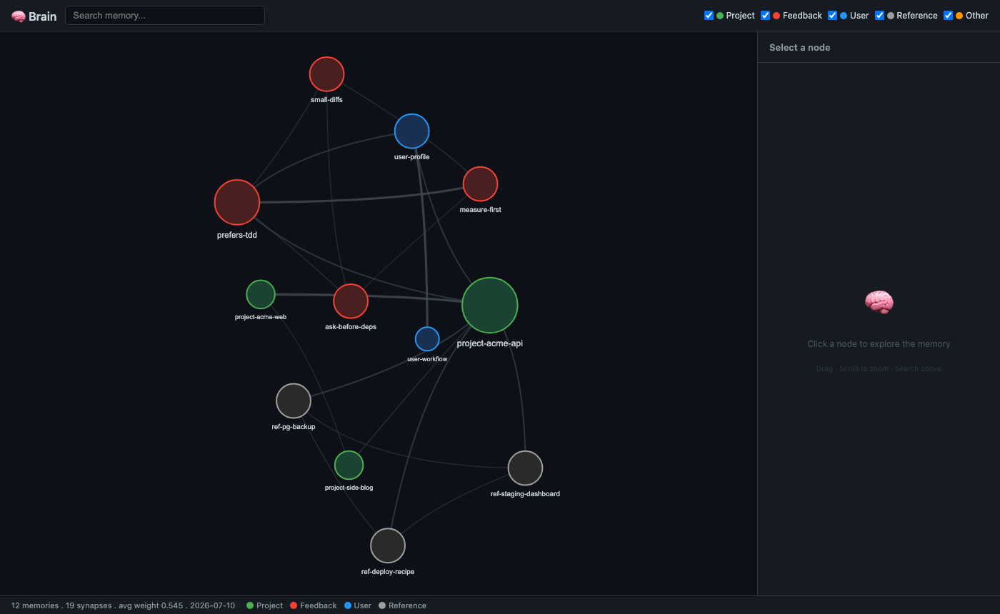

# 🤝 Parce

**Build your own AI personal assistant — with persistent memory, a knowledge graph of its own brain, and one config that works across every AI coding harness.**

*Parce* (from the Colombian slang *parce* = buddy, partner) is a template, not a product. You clone it, run one setup script, give your assistant a name, and from that moment it starts learning about you: who you are, the repos and orgs you work on, how you like things done. Everything lives in plain Markdown files you own, inside a git repo you control.



```
┌─────────────────────────────────────────────────────┐
│  parce/                                             │
│  ├── ASSISTANT.md      ← one source of truth        │
│  │     ▲ CLAUDE.md                (symlink)         │
│  │     ▲ AGENTS.md                (symlink)         │
│  │     ▲ .github/copilot-instructions.md (symlink)  │
│  ├── memory/           ← one fact per file          │
│  │     └── brain.html  ← navigable knowledge graph  │
│  ├── rules/            ← always-on working rules    │
│  ├── contexts/         ← switchable modes           │
│  ├── projects/         ← map of what you work on    │
│  ├── decisions/        ← ADRs worth remembering     │
│  └── skills/           ← reusable procedures        │
└─────────────────────────────────────────────────────┘
```

## Why

Every AI coding tool (Claude Code, Cursor, VS Code Copilot, Codex…) has its own instructions file and forgets you between sessions. Parce fixes both:

- **One brain, any harness.** A single `ASSISTANT.md` is symlinked to whatever filename each tool expects. Change it once, every tool sees it.
- **Memory that compounds.** The assistant writes what it learns to `memory/` — one fact per file, indexed in `MEMORY.md`. Sessions start with context instead of amnesia.
- **A brain you can see.** `skills/brain` builds a weighted knowledge graph from your memories and renders it as an interactive mind map (`brain.html`). Watch your assistant's brain grow.
- **Code-aware.** `skills/graphify-onboard.sh` equips any repo with a typed code graph ([graphify](https://pypi.org/project/graphifyy/)) the assistant can query via MCP — faster and more precise than grep for structural questions.
- **Yours.** Plain Markdown, plain git. No server, no account, no telemetry. Fork it, gut it, make it weird.

## Quickstart

```bash
git clone https://github.com/allanjohny/parce.git my-assistant
cd my-assistant
./setup.sh
```

The setup asks three questions:

1. **What's your assistant's name?** (this is *its* name — pick something you'll enjoy saying)
2. **What's your name?**
3. **What language should it speak?** (English, Português, Español… anything)

It then generates `ASSISTANT.md` from the template, seeds your first memory (`memory/user_profile.md`), and creates the symlinks for every harness. Re-running it is safe.

Open the repo in your AI tool of choice and say hi. It knows its name.

## How memory works

One fact per file, with frontmatter:

```markdown
---
name: prefers-small-diffs
description: User prefers surgical, minimal diffs over broad refactors
metadata:
  type: feedback
---

Keep changes surgical. When you spot unrelated dead code, mention it — don't fix it inline.
```

Four memory types: `user` (who they are), `feedback` (how they want you to work), `project` (ongoing work and constraints), `reference` (pointers to external resources). `memory/MEMORY.md` is the index — one line per memory — and is what gets loaded into context at session start. The assistant maintains all of this itself; the rules are in `ASSISTANT.md` and [docs/writing-memories.md](docs/writing-memories.md).

## The brain 🧠

```bash
node skills/brain/build-graph.mjs
open memory/brain.html
```

Builds a weighted graph from your memory files — explicit links, shared prefixes, shared tags, TF-IDF keyword overlap — and renders an interactive, fully offline mind map. Also patches a `## Related (auto)` section into each memory (top-3 neighbors), so the assistant discovers adjacent context when it reads any single file.

Query it from the terminal:

```bash
node skills/brain/brain-query.mjs deploy docker --top=5
```

## The knowledge base

Memory is for facts; four folders hold the structured knowledge:

| Folder | What lives there |
|---|---|
| `rules/` | Always-on working rules: coding style, security checklist, testing requirements, when to use subagents. Edit them to match *your* standards. |
| `contexts/` | Switchable modes — say "dev mode" or "review mode" and the assistant adopts that behavior profile. |
| `projects/` | A living map of every repo/project you work on ([projects/_index.md](projects/_index.md)); the assistant adds rows as it learns what you touch. |
| `decisions/` | Architecture Decision Records — decisions you don't want re-litigated or accidentally reversed ([decisions/_index.md](decisions/_index.md)). |

## Skills included

| Skill | What it does |
|---|---|
| [`brain`](skills/brain/SKILL.md) | Rebuilds the memory knowledge graph + interactive mind map |
| [`healthcheck`](skills/healthcheck/SKILL.md) | "Are you active?" — self-diagnostic of memory, structure, and symlinks |
| [`dev-local`](skills/dev-local/SKILL.md) | Run any project locally on a multi-project machine without port collisions (never `pkill` again) |
| [`ultra-mode`](skills/ultra-mode/SKILL.md) | Ultra-compressed communication — ~75% fewer tokens, zero lost precision |
| [`logo-designer`](skills/logo-designer/SKILL.md) | Design and iterate on SVG logos |
| [`background-remove`](skills/background-remove/SKILL.md) | Remove image backgrounds locally with rembg |
| [`graphify-onboard.sh`](skills/graphify-onboard.sh) | Equip any repo with a typed code graph via MCP |

Skills are just Markdown with a frontmatter description — write your own by copying any of these.

## Code graphs (optional)

```bash
./skills/graphify-onboard.sh ~/dev/some-repo
```

Idempotent onboarding of any git repo: builds a typed AST graph (`graphify-out/graph.json`), registers the graphify MCP server in the repo's `.mcp.json`, and installs a post-commit hook for incremental rebuilds. Requires [`uv tool install "graphifyy[mcp]"`](https://pypi.org/project/graphifyy/).

## Supported harnesses

| Harness | File it reads | Provided by |
|---|---|---|
| Claude Code | `CLAUDE.md` | symlink → `ASSISTANT.md` |
| Cursor / Codex / Zed / most agents | `AGENTS.md` | symlink → `ASSISTANT.md` |
| VS Code Copilot | `.github/copilot-instructions.md` | symlink → `ASSISTANT.md` |
| Anything else | point it at `ASSISTANT.md` | — |

Details and per-tool tips in [docs/harnesses.md](docs/harnesses.md).

## Philosophy

- **The user is the source of truth.** Memories record what the user said and did, not what the assistant guessed.
- **One fact per file.** Small memories compose; big documents rot.
- **Plain text wins.** Anything you can't `cat`, you don't own.
- **Grow organically.** This template ships the skeleton. Your assistant's personality, skills, and knowledge are yours to develop — that's the point.

## License

MIT. Go build your buddy.
